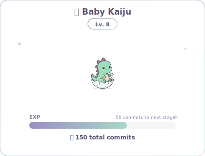

# 🦁 Hi there 🦁

<!-- ========================================== -->
<!-- 🦁 About Me & Links Section                -->
<!-- ========================================== -->
## About me

* Mei Yoshikawa
* Master's student at the Graduate School of Pharmaceutical Sciences, University of Tokyo
* Member of Mizuno Group
* Research interests: Biomedical NLP, Literature Mining, and Knowledge Discovery from Scientific Literature

## Links

* Personal HP: https://devwithkaiju.github.io
* Mizuno Group HP: https://www.mizuno-group.com
* Mizuno Group GitHub: https://github.com/mizuno-group

<!-- ========================================== -->
<!-- 🦖 Stats & Kaiju Section (Side-by-side)    -->
<!-- ========================================== -->

  
  

<!-- ========================================== -->
<!-- 🏆 Achievements Section                    -->
<!-- ========================================== -->

  

<!-- ========================================== -->
<!-- 🛠 Skills Section                          -->
<!-- ========================================== -->

  

